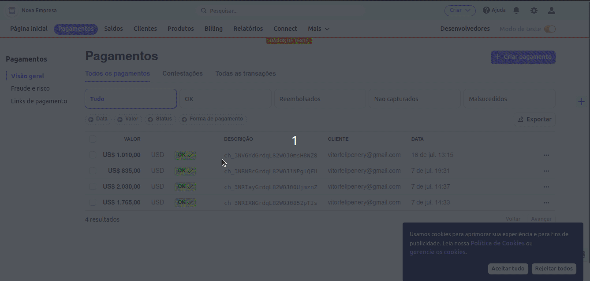

# E-commerce - React & Tailwind 🛒👜🛒👜

> # Description 

This project is a responsive e-commerce website. Users can view information about each product and add/remove products from the cart. Users need to log in to proceed to the checkout.
I styled the landing page with Tailwind CSS and built it with React JS. Tailwind CSS also helped with the website's responsiveness. I created routes to the other pages using react-router-dom. The entire UI of the project was implemented in the client folder. The state was managed using Redux.
Authentication was implemented using Firebase, and payment was integrated with Stripe. Users need to authenticate with Firebase before making a payment.
The products data were fetched from [Fake Store API](https://fakestoreapiserver.reactbd.com/products).   

The project's UI is available here: [React Authentication E-commerce - Vítor F. Nery](https://authentication-ecommerce-vitorfnery.netlify.app/)

## 🛠️ Technologies 

- React 
- Tailwind CSS
- Redux
- Firebase
- Stripe
- Git and Github

## Prerequisites

- Node.js
- NPM

## Installation

1. Clone the repository: `git clone git@github.com:vitorfnery/e-commerce-firebase.git`
2. Navigate to the project directory: `cd your_project`
3. Install the dependencies: `npm install`

## Usage

- Client: Start the development server: `npm run dev` 
- Server: Start the development server: `npm start` 